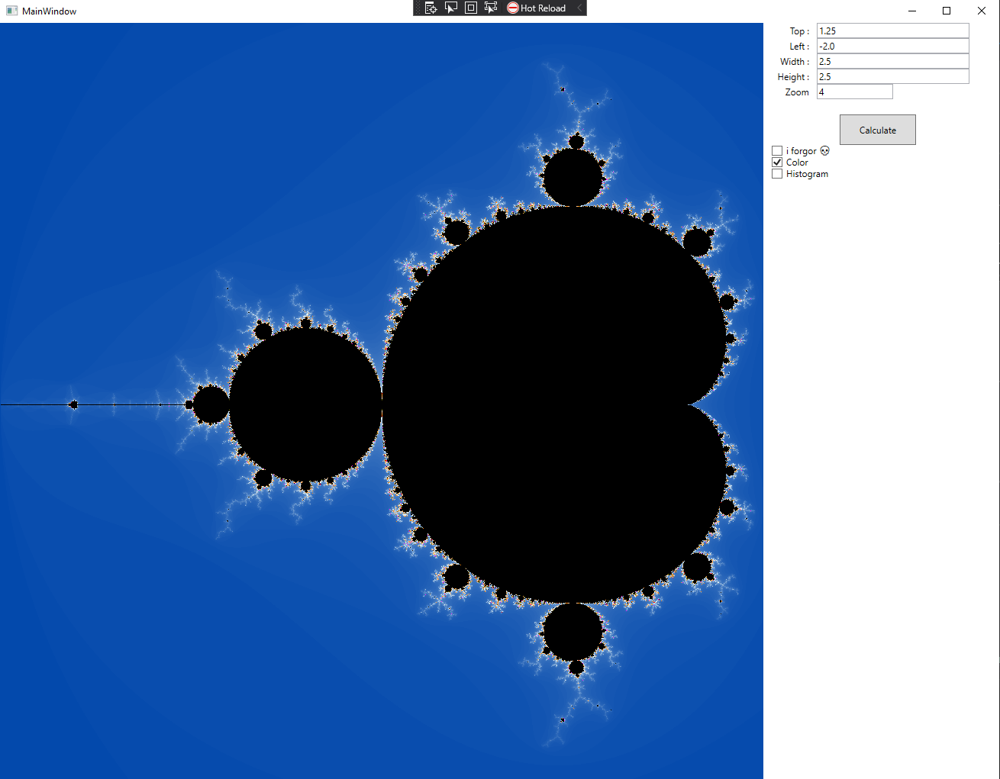

# mandelbrot
A C# WPF app which graphs the famous mandelbrot set, along with controls that allows zoom and coloring options. Multithreaded for optimization.

## An image of the set

## The math

Given a complex number z = a + bi, we can represent it on a two dimensional graph by assigning a as the x-value and b as the y-value. The Mandelbrot set is the set of all z-values where 

zn+1 = zn2 + c

does not diverge. The interesting behavior happens along the boundary. By measuring how many iterations the equation takes before it diverges, we can assign "intensity values" to each number and draw them accordingly. This is the basis of the Mandelbrot set's fractal behavior.

Check out [https://en.wikipedia.org/wiki/Mandelbrot_set](https://en.wikipedia.org/wiki/Mandelbrot_set) to learn more about it.
